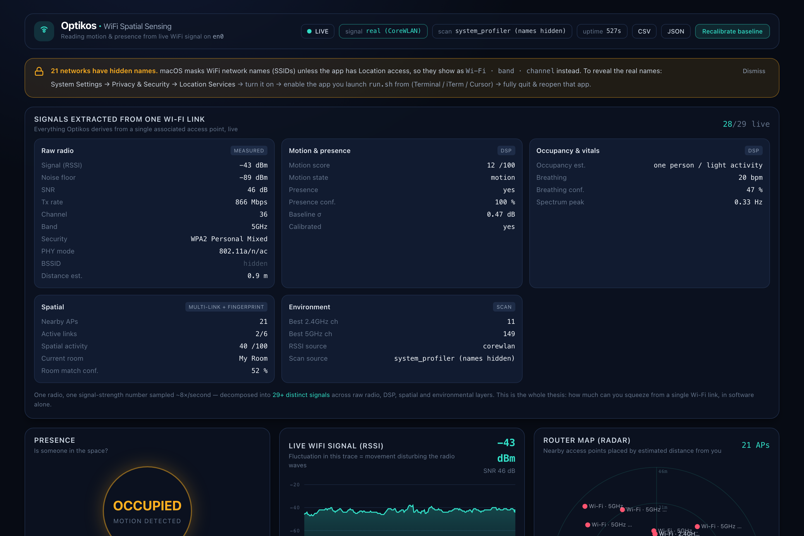
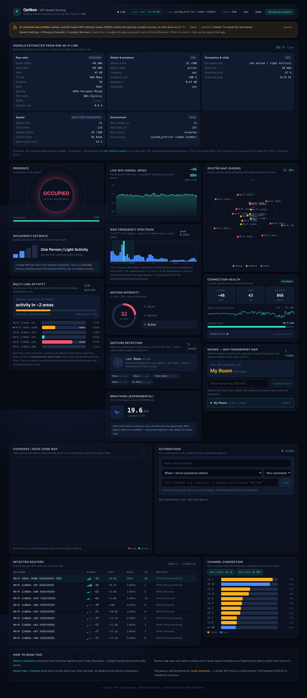
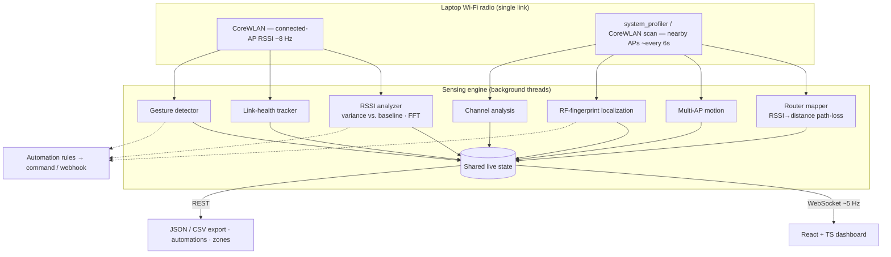

<div align="center">

# Optikos

### How much can you sense from a **single Wi-Fi link** — in software alone?

*Optikos* (from the Greek **ὀπτικός** — "of sight / seeing") turns the ordinary
Wi-Fi connection your laptop already has into a **real-time spatial-sensing
instrument**: motion, presence, coarse occupancy, indoor localization, breathing
estimation, multi-link spatial activity, connection health, and a full RF map of
everything around you — with **no extra hardware**.


<br/>



<sub>Real capture: 28/29 signals live from one associated access point — motion, presence, occupancy, breathing (FFT), multi-link spatial activity, room localization and a full RF map.</sub>

</div>

---

## The thesis

Most "Wi-Fi sensing" demos online either (a) require special CSI hardware, or
(b) overpromise sci-fi ("see people through walls!"). **Optikos asks the honest
question instead:** given nothing but the *received signal strength* (RSSI) of the
one access point your laptop is associated with — a single number, sampled a few
times a second — **how many meaningful signals can you actually extract, and how
far can disciplined signal processing take you?**

The answer turns out to be: **surprisingly far.** One scalar becomes ~30 distinct
live signals across four layers:

| Layer | Derived signals |
| --- | --- |
| **Raw radio** | RSSI, noise floor, SNR, Tx rate, channel, band, BSSID, security, PHY mode, distance estimate |
| **DSP** | motion score, motion state, presence, presence confidence, empty-room baseline, occupancy estimate, breathing rate (FFT), spectral peak |
| **Spatial** | nearby-AP map, per-link disturbance, active-link count, spatial-activity index, RF-fingerprint room localization |
| **Environment** | channel congestion, best-channel recommendation, coverage / dead-zone map, connection health & stability |

> **What it is:** radar-style analytics and RF intelligence from consumer Wi-Fi.
> **What it is *not*:** a camera. RSSI cannot produce video, images or skeletons —
> that needs Channel State Information (CSI) hardware. Optikos is explicit about
> this line, and its architecture is built to plug a CSI source in later.

---

## Highlights

- **Live motion & presence** — variance of RSSI vs. a calibrated "empty-room" baseline.
- **Signals-Extracted dashboard** — every derived signal, live, in one view (the thesis, visualized).
- **RSSI frequency spectrum** — real-time detrended + windowed FFT; breathing band highlighted.
- **Multi-link spatial activity** — tracks several routers at once; more independent links disturbed ⇒ activity spread across the room.
- **Indoor localization** — capture RF "fingerprints" per room, then detect which room you're in.
- **Coverage / dead-zone heatmap** — walk around, click your position, build an IDW signal map.
- **Connection-health monitor** — RSSI/SNR/Tx-rate trends, drop detection, stability score.
- **Automations** — trigger commands / webhooks on presence, motion, gesture or room entry.
- **Data export** — one-click CSV (raw series) and JSON (raw + all derived signals).
- **Runs anywhere** — full physics-flavored simulator when no real Wi-Fi is available.

<details>
<summary><b>See the full dashboard</b></summary>

<br/>



</details>

---

## Architecture



See **[ARCHITECTURE.md](ARCHITECTURE.md)** for the full design: threading model,
data-flow, signal-processing pipeline, and the engineering trade-offs behind each
decision.

---

## The signal → insight pipeline

```
RSSI(t)  ──▶  rolling window (240 samples ≈ 30 s)
             │
             ├─▶ short-term σ ── ÷ calibrated baseline σ ──▶ motion score ──▶ presence / occupancy
             │
             └─▶ detrend (quadratic) ─▶ Hann window ─▶ FFT ─▶ spectrum
                                                              ├─▶ 0.1–0.6 Hz band ─▶ breathing estimate
                                                              └─▶ 0–2 Hz ─▶ live spectrum viz
```

The core intuition: a still, empty room yields an almost-flat RSSI trace. A moving
body reflects/absorbs the 2.4/5 GHz signal, so RSSI fluctuates. Optikos quantifies
that fluctuation and maps it onto interpretable states — with explicit confidence
where the physics is weak (occupancy, breathing).

---

## Tech stack

| | |
| --- | --- |
| **Backend** | Python 3.10+, FastAPI, Uvicorn, NumPy, WebSockets |
| **Signal processing** | rolling-window variance, adaptive calibration, detrended windowed FFT, log-distance path-loss model, IDW interpolation, RF fingerprint matching |
| **Frontend** | React, TypeScript, Vite, Tailwind CSS, Canvas 2D |
| **Platform data** | Apple CoreWLAN (fast RSSI), `system_profiler` (AP scan) |

---

## Quick start

**Requirements:** macOS, Python 3.10+, Node 18+.

```bash
./run.sh          # starts backend + frontend, waits for health, opens the app
```

Then open **http://localhost:5173**.

<details>
<summary>Manual (two terminals)</summary>

```bash
# backend
cd backend
python3 -m venv ../.venv && source ../.venv/bin/activate
pip install -r requirements.txt
uvicorn app.main:app --host 127.0.0.1 --port 8000 --reload

# frontend
cd frontend
npm install
npm run dev
```
</details>

<details>
<summary>Run without real Wi-Fi (simulator)</summary>

```bash
OPTIKOS_SIMULATE=1 uvicorn app.main:app --port 8000
```
Everything runs against a physics-flavored simulator so the UI works anywhere.
</details>

> **Tip:** on start, stay still ~20 s so it learns the empty-room baseline, then
> move around and watch the motion gauge, spectrum, and multi-link panel react.
> Hit **Recalibrate** whenever the environment changes.

---

## API

| Method | Endpoint | Description |
| --- | --- | --- |
| `GET` | `/api/health` | liveness + active data sources |
| `GET` | `/api/state` | one-shot snapshot of the full sensing state |
| `GET` | `/api/routers` | nearby-router map + summary |
| `POST` | `/api/recalibrate` | re-learn the empty-room baseline |
| `GET` | `/api/config` | tunable thresholds |
| `GET` | `/api/export.json` | full dataset: raw series + all derived signals |
| `GET` | `/api/export.csv` | raw connected-link RSSI time series |
| `GET/POST/DELETE` | `/api/zones` | RF-fingerprint rooms + live match |
| `GET/POST/DELETE` | `/api/coverage` | coverage/dead-zone survey samples |
| `GET/POST/PATCH/DELETE` | `/api/rules` | automation rules |
| `WS` | `/ws` | live state stream (~5 Hz) |

Interactive docs (FastAPI): **http://localhost:8000/docs**.

---

## Honest capabilities

| Capability | Reliability | Notes |
| --- | --- | --- |
| Motion detection | ✅ High | robust after calibration |
| Presence (occupied/empty) | ✅ High | short calibration needed |
| Nearby-AP mapping & distance | ✅ Real | coarse distance via path-loss model |
| Channel congestion & health | ✅ Real | genuinely useful Wi-Fi diagnostics |
| Indoor room localization | ✅ Good | after capturing fingerprints |
| Occupancy **count** | ⚠️ Estimate | activity level, not a true head-count |
| Multi-link spatial spread | ⚠️ Estimate | limited by slow scan rate |
| Breathing rate | ⚠️ Experimental | needs a still person near the path |
| Camera-like imaging / pose | ❌ Impossible | requires CSI hardware + models |

This table is deliberately front-and-center: knowing the limits *is* the engineering.

---

## Roadmap

1. **CSI ingestion** — plug an ESP32-S3 CSI source into `backend/app/wifi/`; unlocks real vitals and rough pose. The engine already supports pluggable sources.
2. **Multi-node mesh** — fuse several radios for floor-level tracking.
3. **History & analytics** — persist sessions to SQLite; activity timelines and reports.
4. **Home Assistant / MQTT** — publish presence & motion to smart-home systems.
5. **Windows / Linux backends** — `netsh wlan` / `nl80211` RSSI readers.

---

## Author

**Vinayak Kumawat** — [@vinayakkumawat](https://github.com/vinayakkumawat)

## License

[MIT](LICENSE). Educational / experimental — not for safety-critical or medical use.
